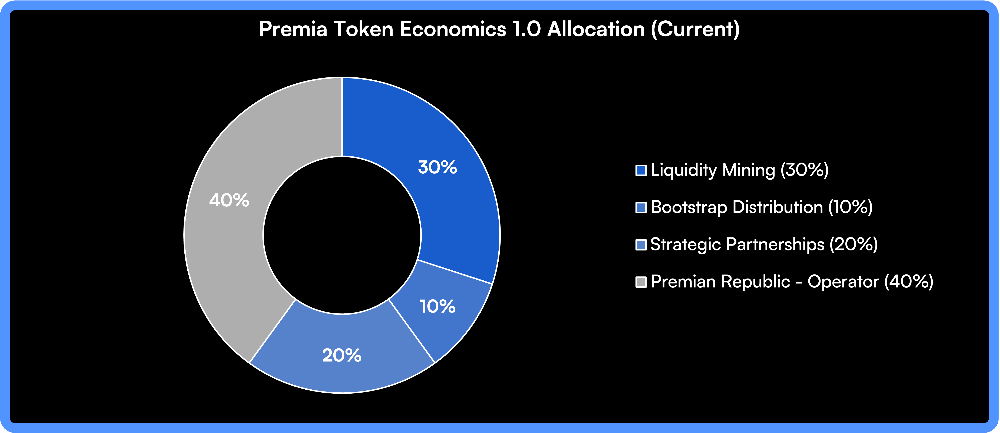
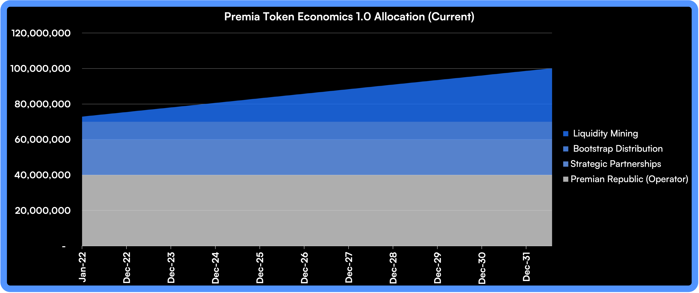

# PREMIA Tokenomics

Current allocation is below, this is subject to change in combination with the implementation of [vxPremia](../vxpremia-core/) and [Blue Descent](../../governance/premian-civitas/blue-descent.md), however all changes require ratification via the [Vote Process.](../../governance/premian-civitas/premian-assembly.md)

* 30% Cross-Chain Liquidity Mining Fund (Liq Mining)
* 20% Development Fund (Operator)
* 10% Safety / Insurance Module (Operator)
* 10% Initial Community Distribution (Bootstrap)
* 10% Founder Allocation (Operator)
* 10% Future Incentives Program (Partnerships)
* 5% Marketing and Education Fund (Partnerships)
* 5% Ecosystem Grants Fund (Partnerships)

<figure><figcaption>
Premia Tokenomics
</figcaption></figure>

<figure><figcaption>
Emission Schedule
</figcaption></figure>

Detailed emission schedule can be found [here.](https://docs.google.com/spreadsheets/d/e/2PACX-1vSUEqdTVLJKGIV8klVDzCtkIy6Y3drbsRnTGXlFHbu8wnHDWUTAa87cFjVhl0kV9QsyNz1-RAo7kwmY/pubhtml)
