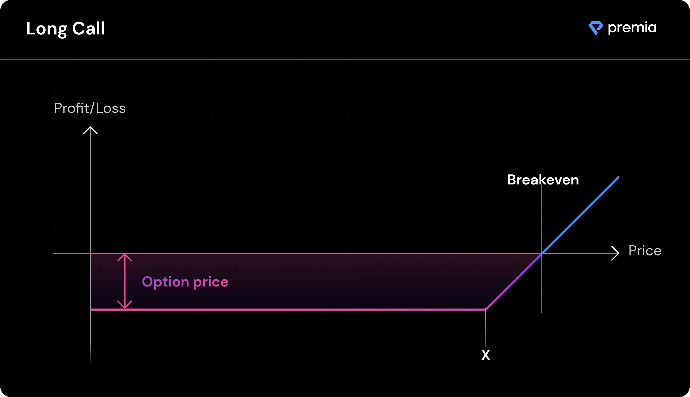

# Options Primer (optional)

**What are options?**

Premia options are [ERC-1155 tokens](https://eips.ethereum.org/EIPS/eip-1155) that offer the holder the rights (but not the obligation) to buy or sell the underlying token by a specified date. While traditional stock option contracts usually represent 100 shares of the underlying stock, options on Premia represent the same number of tokens as described.

_For example**,** a 100 ETH call option represents the right to buy 100 ETH at the option's strike price by the option's maturity date._

Each option has a token pair (e.g. ETH/DAI), an option type (call or put), a strike price (the price at which the option can be exercised), and a maturity date (the expiration date of the option).

**The largest use case for options is hedging risk** (i.e. buying insurance against) the downside risk of tokens one already holds via put options or on the upside risk of tokens one does not already own via call options.

**Call options vs. Put options**

Call options provide the owner of the option the right (again, not an obligation) to purchase the described amount of underlying tokens at the specified strike price, by the option's maturity date. **Buyers of call options believe the underlying token could go up in price over time.**

Put options provide the owner of the option the right to sell the described amount of the underlying token at the described strike price, by the option's maturity date. **Buyers of put options believe the underlying token could go down in price over time.**

.png>)

**American options vs European options**

American options can be exercised any time prior to expiration, where-as European options can only be exercised at expiration. This causes American options to be valued slightly higher than their European counterparts as they have increased opportunity.

Premia offers American-style options.

**The Greeks**

The specific risk metrics of each option can be measured in terms of 5 common metrics, often called The Greeks.

**Delta** - Rate of change of option price compared to underlying token price

**Gamma** - Rate of change of option price compared to **Delta** (can be thought of as acceleration)

**Theta** - Rate of change of option price caused by time value decay

**Vega** - Rate of change of option price compared to implied volatility

**Rho** - Rate of change of option price compared to the risk free rate of return

Traders often use these metrics to compare the risk of options and make decisions as to which option closer meets their strategy.
