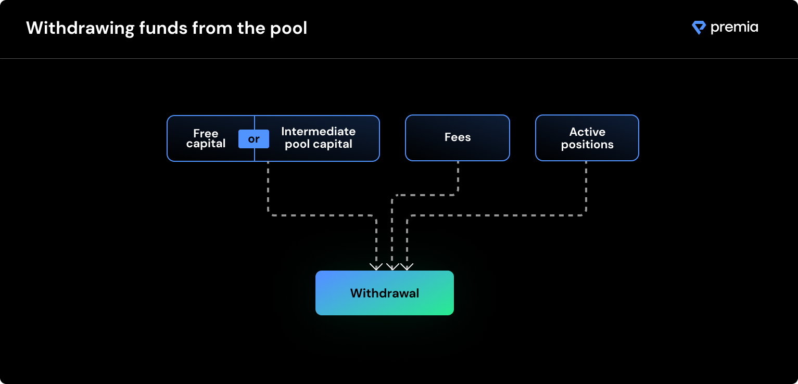

# Exiting the Market (Withdrawals)

Liquidity providers can withdraw their un-utilized free capital in a pool at any moment in time (including unused premiums). If an LP would like to remove active (underwritten option) capital from a pool, they have two choices. They can either pay the pool price to sell the option to another underwriter in the pool, or they can use the Gradual Withdrawal feature to prevent their capital from being used to underwrite future options after expiration.

At any given time of withdrawal, a LP can have up to 3 components to consider: 1) Free capital (or intermediate pool capital); 2) accumulated premiums; 3) active positions underwritten.

At time of withdrawal request, the amount available for withdrawal is calculated as follows:\
\
$$WithdrawalAmount = FreeCapital + PremiumsEarned + AvailableActiveCapital$$

where:

$$FreeCapital$$ = amount of free/intermediate capital available

$$PremiumsEarned$$ = total premiums accumulated from option sales

$$AvailableActiveCapital = sum(OptionSize * (1-OutstandingExposure))$$

such that $$OutstandingExposure$$ = outstanding pool value of underwritten options

LPs can always instantly withdraw their full value from a pool, if they'd like to. However, if a user chooses to withdraw their $$AvailableActiveCapital$$, the user will need to pay the pool price of their actively underwritten options (the $$OutstandingExposure)$$ to withdraw the remaining collateral value.

**Gradual withdrawal**

Alternatively to the complete withdrawal of active funds (at cost), an LP can select a gradual withdrawal. This will prevent the user's capital from being used to underwrite future option sale. As soon as capital is released from unwound positions, it is blocked from re-converting to free capital and can be withdrawn by the user.
