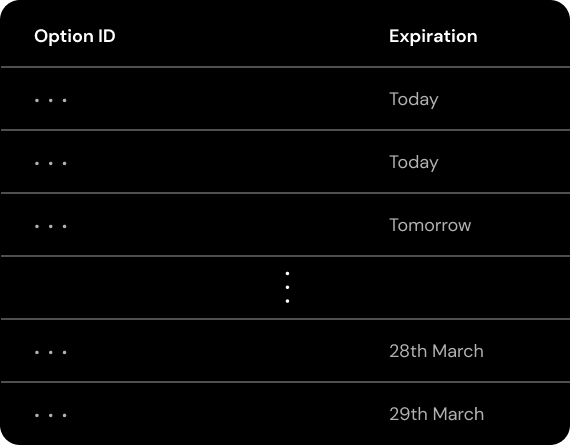

# Underwriting Options

When an option is purchased, the following steps happen in a transaction:

1. Scans intervals required to underwrite position
2. Mints tokens for interval owners
3. Calculates option expiration date
4. Places purchased option in ordered list, by expiration date
5. Updates starting point of Free Capital

.png>)

Suppose we have an option buyer, purchasing option A (assume it's an ETH/DAI call). The buy order will scan as many liquidity intervals as are needed to cover the position. In example above, Option A will cover entirely the liquidity in interval #0 and partially interval #1.

The transaction will mint ERC-1155 tokens for both LP interval owners (#0 and #1). The tokens store the following info:

* Option type
* Asset pair
* Position size
* Strike price
* Expiration date
* Owner address

Once the option is purchased, the liquidity interval is updated. In our example, the Free Liquidity starting point is incremented by +1 (i.e. now Free Liquidity starts from interval #1), and interval #1 size is updated from 3 ETH to 2 ETH (by -1).&#x20;

Whenever an option is purchased, its' expiration is calculated, and it is placed in a list, ordered by expiration times (this is necessary to keep track of expired options, as described in the next section).

The transaction also mints an ERC-1155 token for the buyer, embedding all defining option characteristics me

