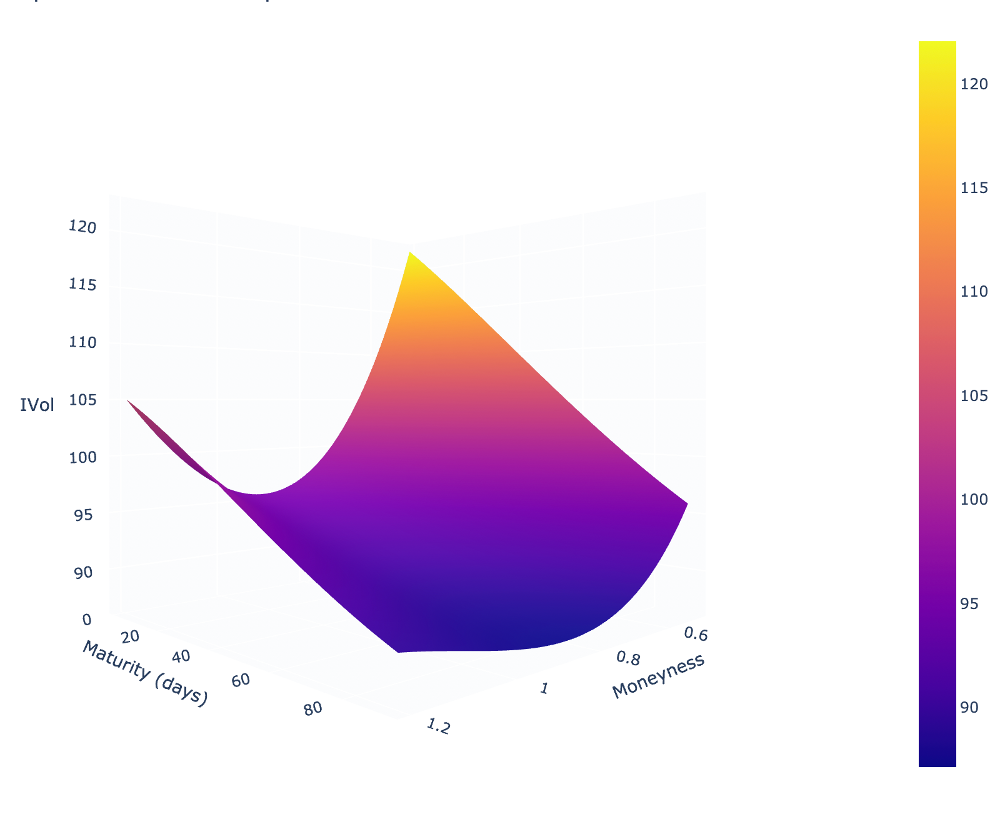

# Implied Volatility

**NOTE:** This is an open area of research. **** If you would like to help us work on this problem, reach out to us on discord, or careers@premia.finance.

Option pricing volatility, often called implied volatility, is a chicken and egg problem:

**Implied Volatility (IVOL), aptly named, is the annualized volatility implied by an option's price**. One can determine the implied volatility of an option price by plugging the final price into the original Black Scholes equation and solving for $$\sigma$$, the volatility parameter implied by the price. However, prices in a modern Black Scholes model are often determined by plugging in an implied volatility value to the model in place of $$\sigma$$. Therein lies the catch 22.

Other than from option prices, implied volatility cannot be directly observed. IVOL per option is a 3-dimensional creature, with its value depending on the the maturity date of the option and the "in-the-moneyness" vs. "out-of-the-moneyness" of the option's strike price.

Because of this three-dimensional nature, the volatility used to price a range of options is often referred to as the IVOL surface, or simply the Volatility Surface.

We must assume that, for any asset, there exists a theoretical market IVOL surface that is known only to the market participants, and cannot be exactly observed or directly derived from any external set of data. Until this true IVOL surface is known to the pools, there will exist a level of IVOL approximation error (if the $$TrueIVOL \neq ProposedIVOL$$), which will skew the price of any given trade in favor of either the LP or the option buyer.

However, given the decision nature of option buying, an option buyer is likely to only engage with trades they perceive favorable, so the majority of this inefficiency will fall upon the LPs underwriting the options.\
\
Because of that, the objective of our approach aims to achieve 2 things:

1. **Propose the best possible starting point for IVOL**
2. **Minimize the cost of adjustment to converge to the true market IVOL**

**If you'd like to skip the research, you can go straight to how the** [**Volatility Surface Oracle**](volatility-surface-oracle.md) **works.**
