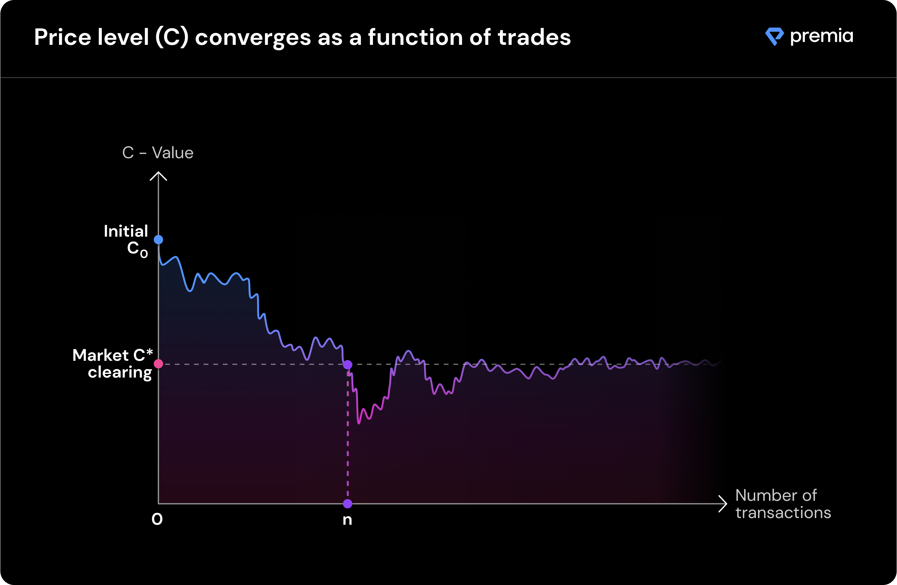

# Option Pricing

### **TLDR;**

* **Nobody knows the exact price crypto options should be worth, because traditional option models do not support the crypto market microstructure.**
* **As a result, any model without built-in market adjustment mechanisms will either consistently overprice or underprice options. The evidence is in the low levels of pool utilization (overpricing) or in the low level of capital in pools (underpricing) across other DeFi options protocols.**
* **Premia introduces a model that takes into account the relative supply and demand of capital within each pool, allowing market forces to converge to the true market price**
* **This implies much higher pool capital utilization (100% at the limit), which in turn translates to higher average returns to LPs without increased prices for buyers.**

### **Key challenge**

In traditional markets, some of the more popular models for option pricing are variants of Black-Scholes and the Binomial Options Pricing Model (BOPM). Unfortunately, they are not effectively applied to the crypto market microstructure, because of how severely it deviates from the assumptions underpinning these models. The specific set of assumptions that do not hold in crypto markets include:

* Market efficiency and zero transaction cost assumptions
* Risk-free rate and volatility of the underlying are known and constant
* The returns on the underlying asset are normally distributed

Because of the crypto market reality, pricing models based on these assumption are unlikely to work. Furthermore, pricing models based on these assumptions are almost certain to cause large losses of capital for LPs or un-realistically high option prices for buyers.

### **Our solution**

Some of the most important features of the Premia pool pricing mechanics include:

* **Market supply vs. demand determines the price through a risk-adjusted model.**
* **Pool pricing always converges to the true market price even under volatile user behavior.**
* **In equilibrium, capital utilization within pools is dictated by market returns (under simulated models, the utilization was typically 85-95%, depending on user behavior).**
* **Greater pool utilization implies better returns to LPs without buyers paying more!**

#### **Notes on exercise value vs. sale value:**

Currently option owners can only exercise their options to the pool, which means the extrinsic value (time value) of an option cannot be captured post-purchase. Selling options back to the pool is currently not implemented, since that would require LPs to take on unnecessary bi-directional risk, and could result in unnecessary losses for LPs.

This is a relatively simple extension to our existing model, and will be remedied in the near future. We are actively working on an upgrade to allow LPs to earn additional returns by market-making for pools, which will enable option holders to sell their options back to the pool. LPs will still have the option to opt-out, ensuring they can maintain their current uni-directional risk exposure if desired.
