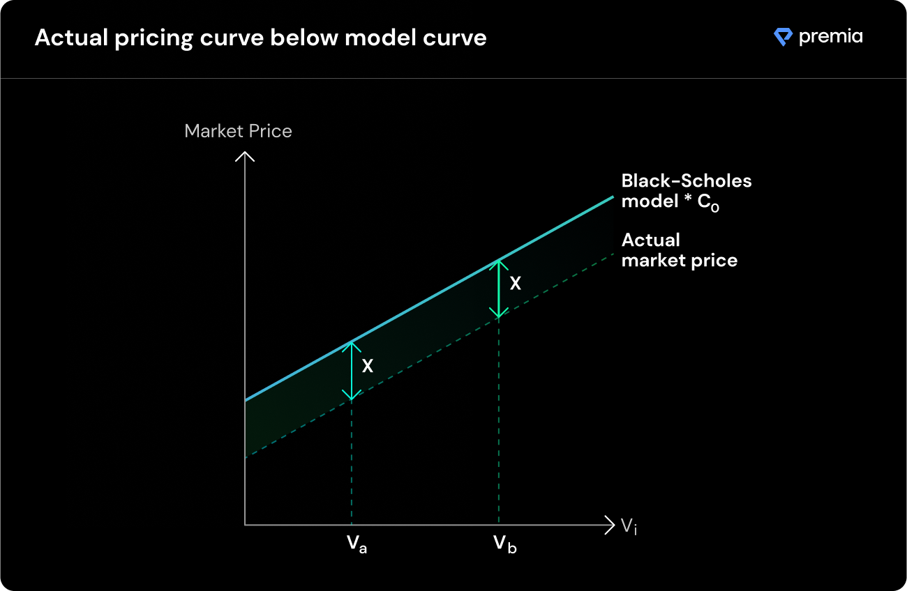

# How Price Converges

**The price convergence mechanism uses a continuous, on-chain reinforcement learning model** to consistently move towards the optimal market price and liquidity utilization rate over time**.**

Each transaction takes place in a discrete time interval from _t_ to _t+1_. After every transaction is made, the pool updates its price level according to the nature of the transaction. Intuitively, in order to find the relationship between the $$BS$$ pricing model and the actual market pricing curve, we're going to start with a random guess for this constant, $$C_0$$, and let the market forces make the adjustment over every ensuing capital flow in and out of the pool.

**Starting from an overpriced "guess constant" and converging to a market clearing equilibrium**

To illustrate the convergence mechanisms, there are some standard assumptions/practicalities to consider:

* Market participants collectively know the market clearing price for any option.
* If the price quoted by the pool at any point in time is greater than the true market clearing price, option buyers will buy fewer options, compared to equilibrium, and LPs will seek to provide more capital, compared to equilibrium.
* If the price quoted by the pool at any point in time, is smaller than the true market clearing price, option buyers will buy more options, compared to equilibrium, and LPs will seek to provide less capital, compared to equilibrium.
* Option buyer demand can only be observed when a purchase is made and capital within a pool is locked as "booked". In other words, if there is no capital in the pool that can be used in option underwriting, the amount of demand by option buyers is unobservable.
* Buyers and LPs will asymptotically act rationally, but bursts of random behavior are tolerated, unless they are highly un-economical and exceed the variance of the rational behavior model.

The best way to illustrate the convergence is to go through how it works in practice. Suppose the magic fairy this time graciously tells us that the market clearing constant between the $$BS$$ model output, $$BS(V_i)$$, and the actual market price is 2, so $$C_{clearing}=2.0$$.

_Keep in mind, in reality the "true"_ $$C_{clearing}$$  _value is never observable._

### **Initialization:**

At initialization, there are zero assets in the pool, and a guess, $$C_{0}$$, which will be used as the initial multiple to $$BS(V_i)$$, to produce the option quote provided to the buyer. Suppose we set $$C_0=5$$.

**Step 0:**\
****Since we know that at initialization the pool overprices the options substantially (by design), the LPs are incentivized to provide capital, as they would expect to earn above market returns for their capital. Suppose that during step 0, some LP joins a pool and provides 100 ETH. The pool makes no adjustments to the C-value at step 0, as the initial liquidity level needs to first be established.

**Step 1:**\
****The options are still overpriced, so further LPs are attracted to provide liquidity in expectation of above market returns. Suppose another LP joins in with an additional 100 ETH. Now, the pool observes that the market pressures are biased towards the supply of liquidity. The "step size" is calculated as the relative change in available liquidity in the pool relative previous state. In this case, the $$stepSize = \frac{(200-100)}{200}=0.5$$ .

This step size is used as input to an exponential decay function, to get $$e^{-(0.5)}=0.6065$$. We multiply this number by our initial $$C_{0}$$ to update our beliefs of what the market clearing C-value should be. Our improved guess after step 1 is now $$C_{1}=C_0*0.6065=5*0.6065=3.0325$$ , which is much closer to the market clearing C-value of 2.

**...**

**Step -> n:**

Due to the volatility of user behavior, we are likely to see option purchases even if the buying price has not yet reached market equilibrium, so the C-value will go up and down, until it ultimately converges to within one digit percentage errors of the market clearing conditions.

**Key insight:** The convergence is conditional on $$C_{0}$$ being initialized above the market clearing level because demand cannot be observed unless there is capital in the pool.

**Key explorations to follow:**

* **The initial** $$C_0$$ **value has a direct impact on convergence dynamics. The higher this initial value, the greater the likelihood of asymptotic convergence. This relationship flips for limited step count models.**
* **The exponent base in the model directly influences the convergence profile. It is not immediately obvious what the key characteristics are of a convergence process that constitute a healthy market.**
* **Is there a better base pricing alternative to vanilla BS?**
* **Does a multi-dimensional C-value, specific to option strike price and maturity, provide a more optimal pricing mechanism than the current single-dimensional value?**
