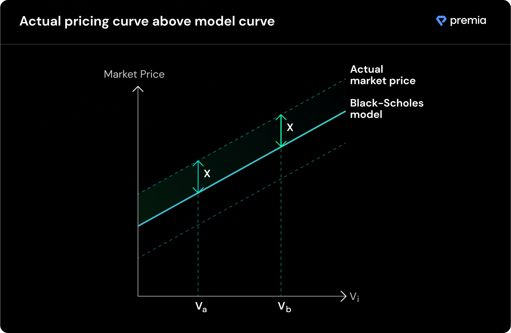

# The Pricing Model

**All models are wrong - but the good ones are useful.**

This can also be said about the application of **Black-Scholes** to the crypto markets. The traditional model requires the following inputs:\
\
1\. Strike price\
2\. Spot price\
3\. Option maturity\
4\. Implied volatility\
5\. Risk free rate of return

The final Premia pool pricing model also depends on the following inputs:\
\
6\. Position size\
~~~~7. Pool capital supply and demand\
\
For simplicity, let's just consider all of the inputs required as a 5 dimensional input vector $$V_i$$. Even though the model cannot be trusted to produce perfect equilibrium pricing, it still contains fundamental embedded relationships about how the change in each input factor affects the output price, due to the specific risk-adjusted metrics of the option.

Suppose there exists a theoretical market pricing curve (at which the crypto option market clears) for all input vectors $$V_i$$. There is no reason to assume, that the difference (depicted as $$X$$ in the diagram below) between the Black-Scholes $$(BS)$$ model output and the actual market price would be inconsistent across different values of $$V_i$$. In fact, the deviations from the classical market microstructure assumptions do not appear to be a reason why the fundamental dynamics of option pricing should break down. **In other words, there is no reason to assume that the shape of the equilibrium pricing curve is materially different from that of the Black-Scholes dynamic-hedge based model.**

Intuitively, suppose we have two different options. They both have different strike prices, different maturities, and different implied volatilities. Suppose that the unobservable real market price of one of these options is 110 DAI, while the $$BS$$ model suggested price is 100 DAI. This implies that $$BS$$ underprices this option by 10%. There is no reason why the other option, with a different maturity and strike price, should be underpriced by the $$BS$$ model by any other amount than 10%.&#x20;

In other words, we can assume that there exists a linear relationship between the actual market pricing curve and the $$BS$$-suggested curve, and that this relationship is consistent (practically speaking) across all levels of $$V_i$$. So in order to find a market clearing pricing curve, we have to uncover this linear relationship. But how can we achieve that?

**We let the market demonstrate the relationship between** $$\bold{\textit{BS}}$$ **and the actual market price curve**

The answer to understanding this relationship lies in allowing the market forces to quickly converge towards it. The pricing mechanism used by Premia consists of 3 parts: \
****\
******1) Original Black-Scholes Model**\
**2) Current pool price level, adjusted for impact of option size**\
**3) Discrete liquidity adjustment coefficient to update the price level**

$$
P_{t}(V_i;C_t)=BS(V_i)*C^*_t
\\
s.t.\hspace{0.25cm}C^*_t=C_t*\int^0_{x_t}e^{-x} \alpha_x*(\frac{1}{0-\frac{(S_{t+1}-S_t)}{max(S_{t+1};S_t)}})
\\
C_{t+1}=C_t*e^{-\alpha_x\frac{(S_{t+1}-S_t)}{max(S_{t+1};S_t)}}
$$

****

$$P_t$$ - Price quoted by the pool for an option at time _t_\
****$$BS(V_i)$$ - Black-Scholes model output for the selected option\
$$V_i$$ - Vector of $$BS$$ model inputs (spot price, strike price, maturity, implied volatility, risk free rate)\
$$C_t$$ - Pool price level (liquidity adjustment coefficient) at time _t_ (current period)\
$$C^*_t$$ - Pool price level adjusted for price impact of option size __ [_\[see Price Impact by Size\]_](price-impact-by-size.md)\
$$S_t$$ **** - Pool size at time _t_ (current period)\
$$S_{t+1}$$ **** - Pool size after purchase (at time _t+1)_\
$$\alpha_x$$ **** - Trade-specific steepness parameter, currently defaulted to 1 for all trades (no effect)

_One implication of this model is the resulting price can be less than the intrinsic (exercise) value of the option when the C-level is exceedingly low. As such, we have implemented a **Minimum Return** model for the safety of LPs, such that the final price of an option offered by a pool will always be at least as high as the intrinsic value of the option, plus a minimum annualized return (even if the standard model produces a lower price)._
