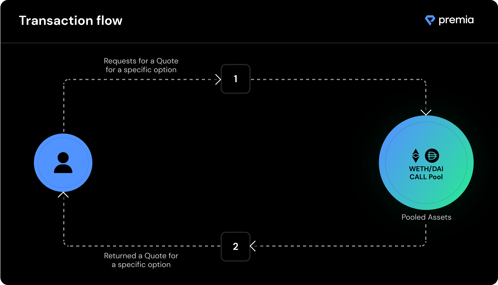

# Transaction Flow

There are 2 pools for each asset pair on Premia: a **Call pool** and a **Put pool**. This allows both liquidity providers to granularly decide which pool they'd like to underwrite and option buyers to select which direction they'd like to trade. A win, win.

When a user wants to purchase an option from the pool, they can simply send the details of the option they'd like to purchase to the pool, and the pool will return a quoted price for the user's selected size, strike price, and maturity date. If the user agrees with the price, they can execute the trade with an on-chain transaction.

The option is then owned by the purchaser and represented as an [ERC-1155 token](https://eips.ethereum.org/EIPS/eip-1155) in their wallet, allowing the user to transfer the option or exercise it at a future time.

**Example:** If user wants to buy a call option from a call option pool, they:‌

**1**. Send a request to the pool, specifying the following values: \
****\
******strike price** \
**maturity**\
**size of option**

_(example: ETH/DAI call option, with strike price 3,500 DAI; maturity 20 days; option size of 2 ETH)‌_

_**Keep in mind these details are automatically sent to the correct Pool to retrieve a quote for the user when a specific option is selected on the Premia web interface.**_

**2.** Pool sends back a quoted price for the option.

(example: 0.1 ETH)‌

**3.** If the user agrees with the price, they can confirm and execute a transaction to purchase the option at the specified price (allowing for slippage, in case another user simultaneously purchases an option from the pool).

**4.** When the transaction is confirmed, the user receives the American option they purchased. The user can then exercise the option at any time after purchase to unlock the rewarded tokens in the option and return the remaining capital to the pool. After expiration, if an option has not been exercised, its exercise value is locked to the value of the option at the time of exercise.

This ensures the option holder always receives the full value of their option and liquidity providers can immediately recover their capital after expiration.
