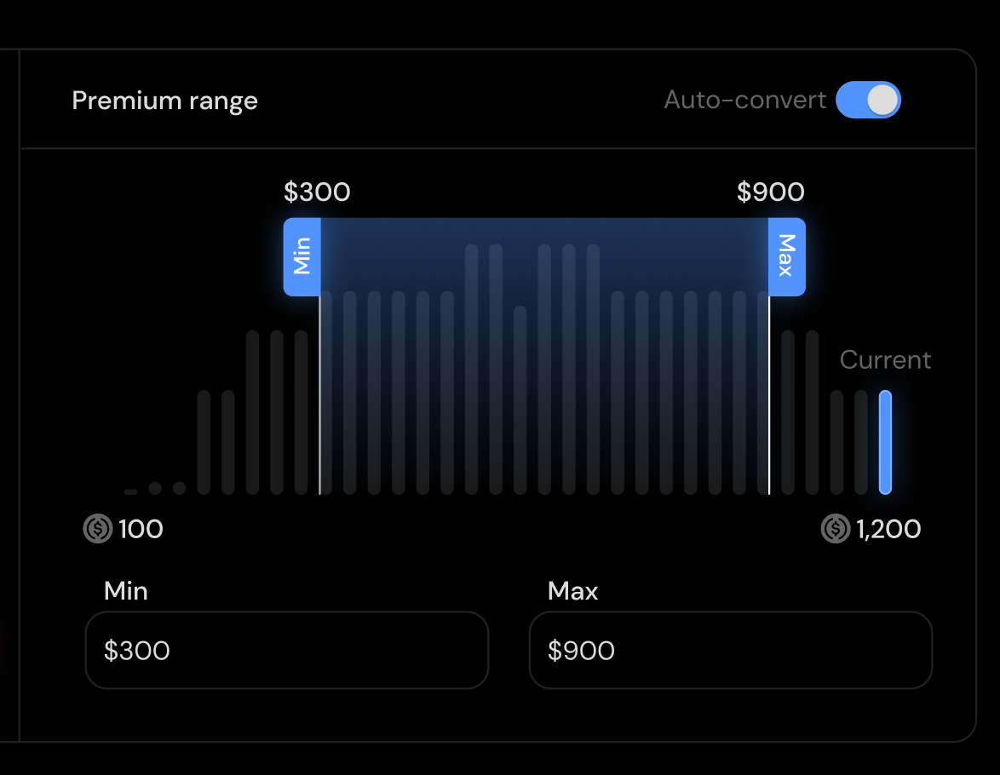
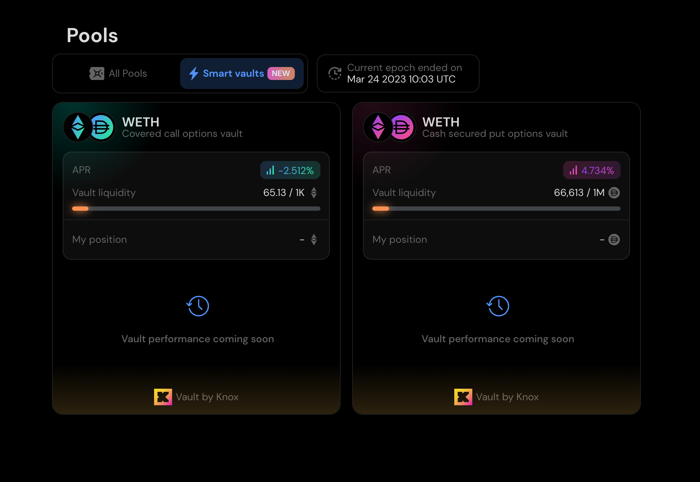

# Quick Start

## <mark style="color:blue;">Connecting to a Chain & Wallet</mark>

Connecting to the UI can be done via the following wallets. If you do not have a wallet yet, you can use [MetaMask](https://metamask.io/download/):

<figure><figcaption></figcaption></figure>

Premia V3 is currently available solely on [Arbitrum Mainnet](https://arbitrum.io/).   If using MetaMask as a wallet,  you can visit [Arbitrum One (42161)](https://chainlist.org/chain/42161)  (or [Arbitrum Goerli (421613)](https://chainlist.org/chain/421613) if using testnet) and add the chain quickly and easily.&#x20;

## <mark style="color:blue;">Selecting an Option</mark>

From the Trade tab, there is the option to view markets in either a **Basic** layout or an **Orderbook** layout. The orderbook layout will provide more details beyond just price. Additionally, the underlying, option type (Call or Put), and trade direction are used to help narrow down the option pools.

<figure><figcaption></figcaption></figure>

\
To receive quotes, a Strike, Expiration and Option Size (Trade Size) are required.

<figure><figcaption></figcaption></figure>

Quotes will populate for a given market once all market parameters have been selected. Multiple quotes may appear and the source of these quotes may be of different origin (ie. Vault, Orderbook, or Option Pool). Additionally, markets with different oracles (but the same Token Pair), will also appear.

The quotes are arranged in order of best price. By selecting a quote, a confirmation window will pop up to proceed with executing a trade. You can then select your payment token and see potential profit and loss.

<figure><figcaption></figcaption></figure>


It is prudent to note that trades can only be _closed_ using the market the trade was _opened_ in. For example, WETH/USDC (Chainlink) and WETH/USDC (Uniswap) are not the same market!. &#x20;


## <mark style="color:blue;">Trading</mark>

### **Executing a trade (Basic)**

Prior to execution of a trade, basic information is given about the trade. Trades can be initialized with _any_ asset as collateral, but will be converted to the collateral asset of the option prior to executing the trade using a DEX aggregator. Users can set slippage controls for swaps if needed. The default is 0.5% slippage for swaps.

<figure><figcaption></figcaption></figure>

### **Executing a trade (Orderbook)**

Using the Orderbook view for execution, we can see and traverse through multiple Expirations horizontally and Strikes vertically. Additionally, each Strike can be expanded to see additional information about the option itself, such as Implied Volatility, Bid/Ask Price & Size, Market Price, and Option Greeks.

<figure><figcaption></figcaption></figure>

### **Submitting a range order**

By selecting the Pools tab, we are able to begin the process of submitting a range order and becoming an LP (Liquidity Provider) for a specific pool. Similar to executing a trade, details of the desired pool must be provided first.


💡 It is important to know that a single options market (Pair, Strike, Expiration, Type) makes up a single option pool. Therefore range orders are _option specific_. This is not to be confused with being an LP for a vault, which may trade many different options.


<figure><figcaption></figcaption></figure>

<figure><figcaption></figcaption></figure>

### **What does a Buy or Sell Range Order mean?**

Range orders are _side specific_. When initializing a range order, an LP must define the exposure type they would prefer. For example, if an LP would not mind a short exposure (or is depositing long option contracts they would not mind selling), the order type would be a SELL range order. Conversely, if an LP would not mind a long exposure (or is depositing short option contracts they would not mind closing), the order type would be a BUY range orders.

### **Min & Max Values of a Range Order**

Besides the size of the range order, a min and max price limit must be set. For convenience, an Auto-convert toggle is available to see prices in the quote asset.

For more information regarding Range Orders and how they work please see [LP Range Orders](the-premia-protocol/concepts/lp-range-orders.md).

<figure><figcaption></figcaption></figure>

## <mark style="color:blue;">Managing Positions</mark>

When a wallet is connected, a user is able to click on the Positions tab to see existing option positions for the given wallet address. If a user would like to close a position, it is best to select the option from your portfolio and close/modify the trade from here. By doing so, the position will be closed, and collateral released (if short).

Alternatively, positions can be closed directly from the Trade page. If the trade size is larger than the existing position, the position will first be closed before creating new exposure in the opposite direction.


💡 If using the Trade page to close a position, be sure that the oracle for the underlying market is the same, otherwise they are treated as two separate markets.


<figure><figcaption></figcaption></figure>

## <mark style="color:blue;">Staking Premia Token</mark>

Users may stake the Premia token for many reasons. In order to stake Premia tokens, a lock up period must be selected (zero days can be selected). The longer the lock period, the more influence (votes) the staked premia will have and the more staking rewards that can be earned. Staked Premia also shares in earnings from trading fees. Currently, any tokens not paid directly to LP’s are split 50/50 between stakers and the protocol.

For additional details on Governance and Voting, please see [here](broken-reference).

<figure><figcaption></figcaption></figure>

<figure><figcaption></figcaption></figure>

### **Voting**

Staked Premia allows a user to vote on liquidity mining emissions by Vault or Pool. There is incentive to direct liquidity mining emissions to active markets which generate the highest amount of fees, as it will generate higher USDC returns for stakers. Voting can be done at any time, and weights are updated on each block.

<figure><figcaption></figcaption></figure>

<figure><figcaption></figcaption></figure>

## <mark style="color:blue;">Vaults</mark>

Vaults can be accessed through the Vault tab. Here you will find various single purpose vaults that allow participants to passively earn a return on their investment, manage risk, or hedge specific positions.


💡 Each vault has their own mandates and risk profiles. Please ensure that the risks and investment type are suitable for your needs. Additional information about vaults on this page can be found here.


<figure><figcaption></figcaption></figure>

After determining the appropriate vault, it is as simple as selecting the token that will be used for depositing (a swap will be performed if the asset is not the Vault asset).

### **Vaults Detailed**

Each vault has a detailed page in which specifications about the vault can be found.

<figure><figcaption></figcaption></figure>
