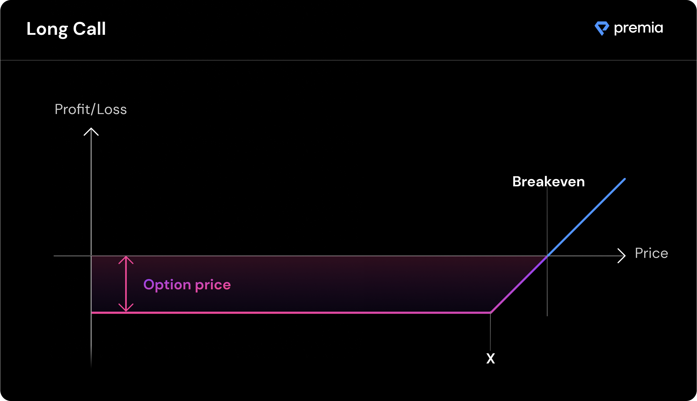

# Options Primer

### <mark style="color:blue;">Options Primer</mark>

**The largest use case for options is hedging risk** (i.e. buying insurance against) the downside risk of tokens one already holds via put options or on the upside risk of tokens one does not already own (or is short) via call options.

Options are also the most popular financial product to express views on volatility (and directional exposure). They exhibit many traits that allow users to curate their desired risk profiles by combining multiple options or using various expirations/strikes.

#### **Call options vs. Put options**

Call options provide the owner of the option the right, not an obligation, to purchase the described amount of underlying tokens at the specified strike price, by the option's maturity date. **Buyers of call options believe the underlying token **_**could**_** go up in price over time beyond the cost of the premium paid.**

<figure><figcaption></figcaption></figure>

Put options provide the owner of the option the right to sell the described amount of the underlying token at the described strike price, by the option's maturity date. **Buyers of put options believe the underlying token **_**could**_** go down in price over time time beyond the cost of the premium paid.**

<figure><figcaption></figcaption></figure>

#### **The Greeks**

The specific risk metrics of each option can be measured in terms of 5 common variables, often called _The Greeks_. Traders often use these metrics to compare the risk profiles of different options and make decisions as to which option closer meets their strategy. It is important to keep in mind that The Greeks are dynamic, based on current market prices, and are constantly changing, meaning the variables are instantaneous in nature and should not be considered long-term truth values.

**Delta**

The change of option price due to price change of the underlying token. Call options have positive delta, put options have negative delta.


_A Delta of 0.5 means the option price changes $0.50 for every $1.00 change in the price of the underlying token pair._


**Gamma**

Rate of change of the option Delta given a change in price of the underlying token. Gamma is positive if you are long an option (call or put) and negative is you are short an option (call or put).


_A Gamma of .01 means the Delta will go up(down) by .01 for every $1.00 change up(down) in the price of the underlying token pair._


**Theta**

The change in option price caused by time value decay. Theta is positive if you are short an option (call or put) and negative is you are long an option (call or put).


_A Theta of -5 means the option price will decay at a rate of $5 every day prior to expiration (all else being equal)._


**Vega**

The change in option price caused by a change in an options implied volatility. Vega is positive if you are long an option (call or put) and negative is you are short an option (call or put).


_A Vega of 2 means the option price will increase(decrease) by $2 for every 1% increase(decrease) in the option’s implied volatility._


**Rho**

The change in option price caused by a 1% change in an options interest rate (typically the risk free rate). Calls have a positive Rho, Puts have a negative Rho.


_A Rho of 0.5 means the option price will increase(decrease) $0.50 for every 1% increase(decrease) in the interest rate._

